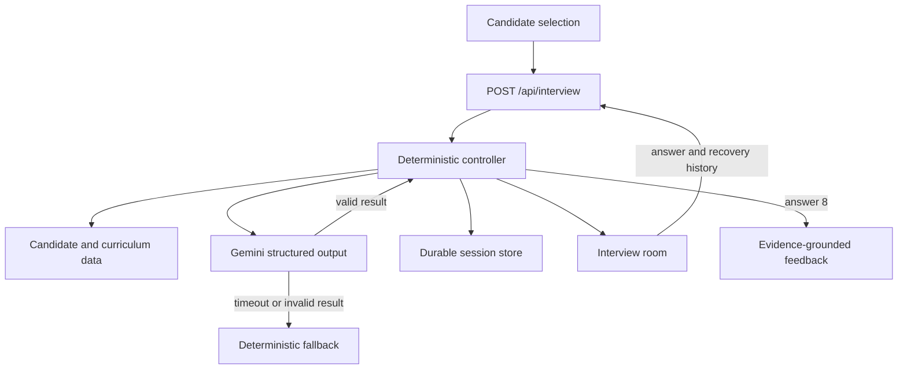

# Architecture

## Overview

ABTalks Interview Agent is a self-contained Next.js application with a hybrid interview architecture:

- a deterministic controller owns eligibility, coverage, question count, validation, recovery, and fallback behaviour;
- Gemini 2.5 Flash performs semantic answer assessment, adaptive question generation, and evidence-grounded feedback through strict JSON schemas;
- Netlify Blobs provides strongly consistent active-session storage on the deployed Netlify site;
- an in-memory cache reduces repeated durable reads; and
- the bundled browser can reconstruct a missing session from its local transcript.



## Application layers

### Presentation layer

- `app/page.tsx`: product landing page
- `app/setup/page.tsx`: server wrapper for candidate data
- `components/setup-client.tsx`: candidate search, selection, and session start
- `components/interview-room.tsx`: transcript, progress, recovery history, and answer submission
- `components/report-view.tsx`: structured feedback and grounded readiness score
- `components/site-nav.tsx`: navigation and theme preference

### API layer

`app/api/interview/route.ts` implements the required `POST /api/interview` contract.

It is responsible for:

- bounded request-body parsing;
- deep candidate and curriculum-day validation;
- start-versus-turn request discrimination;
- per-IP and per-session rate limiting;
- duplicate-turn protection;
- memory, durable, and client-assisted session recovery;
- orchestration of Gemini and deterministic fallback paths;
- completion after exactly eight answers; and
- contract-compatible JSON errors.

### Interview-controller layer

`lib/interview-engine.ts` is authoritative for interview policy.

It:

1. accepts only explicit passed missions mapped to real curriculum days;
2. requires at least four eligible completed days;
3. prioritizes higher-attempt missions while preferring module diversity;
4. guarantees eight questions and four-day coverage;
5. forces an uncovered day when remaining question slots make it necessary;
6. branches toward clarification for weak or evasive responses;
7. provides richer deterministic assessment when Gemini is unavailable;
8. aggregates assessment dimensions into a defensible readiness score; and
9. rebuilds state from client history without asking about skipped topics.

### Semantic-interviewer layer

`lib/gemini-interviewer.ts` calls Gemini only from the server.

Each turn sends:

- the candidate's role, experience, and synthetic learning signals;
- only the selected completed curriculum days, objectives, and tools;
- the compact interview transcript;
- prior assessment verdicts and gaps; and
- the current answer as explicitly untrusted quoted evidence.

Gemini returns structured JSON validated by the application. It independently scores:

- technical accuracy;
- technical specificity;
- reasoning;
- communication; and
- production awareness.

The model also selects an allowed next curriculum day and one interview mode: follow-up, clarification, challenge, new topic, or synthesis. The deterministic controller rejects disallowed days and remains authoritative over completion and coverage.

If the key is missing, the model times out, a quota is exceeded, the response is invalid, or validation fails, the same request completes through the deterministic fallback.

## Session model

An active session contains:

```ts
type InterviewSession = {
  candidate: Candidate;
  plan: CurriculumDay[];
  questionNumber: number;
  daysCovered: number[];
  records: InterviewRecord[];
  lastQuestion: string;
  currentDay: number;
  createdAt: number;
  updatedAt: number;
  expiresAt: number;
};
```

Sessions expire after two hours and are deleted immediately after final feedback is returned.

## Continuity and deployment

### Netlify

Netlify Blobs stores active sessions in a site-scoped store named `abtalks-interview-sessions`. Strong reads are used so a request routed to another function instance can recover the latest session. Netlify provisions the storage context for deployed functions.

### Local development and other platforms

The application uses the in-memory cache when Netlify Blobs is unavailable. The bundled client additionally sends its candidate, answer list, and sanitized transcript as optional recovery context. This permits deterministic reconstruction after a cold instance while preserving the organiser's minimum `sessionId + message` request.

For a large multi-platform production system, the same storage functions can be replaced with Redis or Postgres without changing the public API.

## Privacy boundary

- Gemini credentials remain server-side.
- Candidate answers are sent to Gemini only when semantic mode is enabled.
- Candidate text is treated as untrusted and cannot override the interviewer instructions.
- Completed reports are stored only in the current browser.
- No authentication, real accounts, or long-term server-side report history is implemented.
