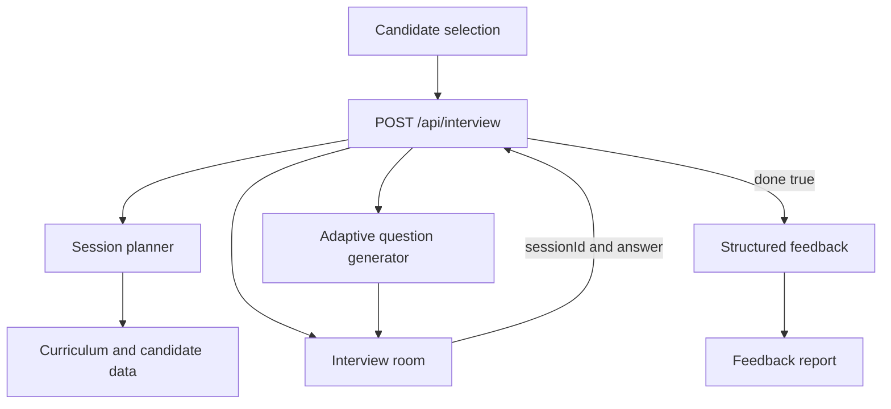

# Architecture

## Overview

The project is a self-contained Next.js application. UI routes, the interview API, curriculum data, and candidate data live in one deployable repository.



## Application layers

### Presentation layer

- `app/page.tsx`: product landing page
- `app/setup/page.tsx`: server wrapper for candidate data
- `components/setup-client.tsx`: candidate search, selection, and session start
- `components/interview-room.tsx`: conversation, timer, progress, and answer submission
- `components/report-view.tsx`: feedback visualization
- `components/site-nav.tsx`: global navigation and theme preference

### API layer

`app/api/interview/route.ts` implements the required `POST /api/interview` contract.

Responsibilities:

- Validate request JSON.
- Start a session from a supplied candidate.
- Select relevant completed missions.
- Prioritize mission diversity and higher-attempt concepts.
- Maintain question number, covered days, and evaluations.
- Generate answer-dependent follow-ups.
- Finish only after eight answers.
- Return structured feedback.

### Data layer

- `data/curriculum.json`
- `data/candidates.json`
- `data/technical-spec.md`

The current MVP does not mutate these files.

### Client continuity

The browser stores the active session transcript and final report in `localStorage`:

- `abtalks-interview-session`
- `abtalks-final-report`
- `abtalks-report-history`
- `abtalks-theme`

This storage supports refresh-safe UI continuity on the same device. The API remains authoritative for active interview progression.

## Interview-planning strategy

1. Filter candidate missions to completed missions.
2. Sort by attempt count to identify concepts that may need deeper probing.
3. Select different curriculum modules before selecting additional days from the same module.
4. Build an eight-question sequence across six curriculum days when possible.
5. Use questions 2, 4, and 6 as answer-dependent follow-ups.
6. Evaluate response specificity and curriculum vocabulary.
7. Aggregate observations into structured feedback.

## Session model

An active server session contains:

```ts
type Session = {
  candidate: Candidate;
  plan: CurriculumDay[];
  questionNumber: number;
  daysCovered: number[];
  evaluations: Evaluation[];
  lastQuestion: string;
};
```

The session is addressed only through the caller-provided `sessionId`.

## Deployment model

The repository supports standard Next.js deployment:

- Vercel through automatic framework detection
- Netlify through `netlify.toml` and the official Next.js adapter
- Any Node.js platform capable of running `next start`

## Production evolution

For a larger production system:

- Replace the in-memory session map with Redis, Postgres, or another low-latency session store.
- Replace or supplement deterministic question generation with an LLM provider.
- Validate LLM output against typed response schemas.
- Add tracing, rate limiting, evaluation datasets, and prompt-version tracking.
- Keep the public API contract unchanged.
